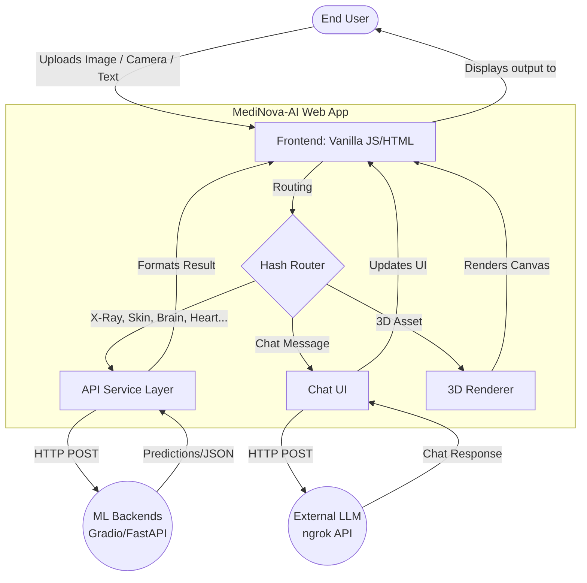
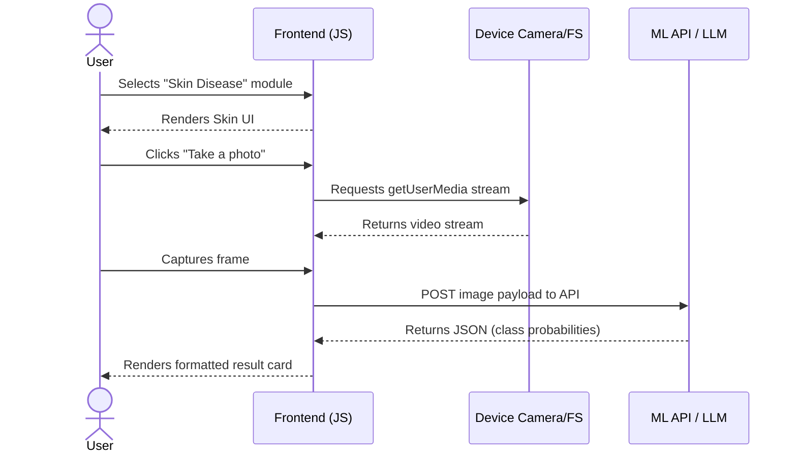
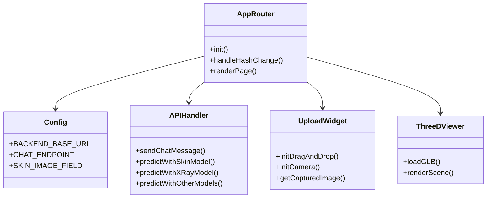

# GRADUATION PROJECT REPORT

## MediNova-AI
*A Web-Based Healthcare Assistance System*

**GitHub Repository:**
[https://github.com/Alaa-AHK/MediNova-AI](https://github.com/Alaa-AHK/MediNova-AI)

### Team Members
| Name | Email | Phone number |
| --- | --- | --- |
| Alaa Abdelhakeem | alaaabdelhakeem47@gmail.com | 01123199165 |
| Salma zaghloul samak | salma.zaghloul56@gmail.com | 01280700033 |
| Afnan Magdy Eweis | Afnanmagdy20005@gmail.com | 01141641440 |
| Rokia Hassan Ahmed Mohamed | rokiahassan93@gmail.com | 01152533383 |
| Fady Youssif Esstemalk | gossef512@gmail.com | 01228488639 |
| Fares Waleed Badawi | fareselkhayat949@gmail.com | 01223279568 |

## Table of Contents
1. Project Planning & Management
   - 1.1 Project Proposal
   - 1.2 Objectives
   - 1.3 Scope
   - 1.4 Project Timeline & 1.5 Task Assignment
   - 1.6 Risk Management
2. Literature Review
   - 2.1 Overview of AI in Healthcare
   - 2.2 Diverse Radiology & Pathology Systems
   - 2.3 Skin Disease Detection
   - 2.4 Prescription Assistance Systems (OCR)
   - 2.5 Medical Chatbots & LLMs
   - 2.6 3D Medical Visualization
3. Requirements Gathering
   - 3.1 Stakeholders
   - 3.2 User Stories
   - 3.3 Functional Requirements
4. System Analysis & Design
   - 4.1 System Architecture
   - 4.2 Data Flow Description (DFD)
   - 4.3 Sequence Flow
   - 4.4 Class / Component Diagram
   - 4.5 Technology Stack
   - 4.6 Deployment

## 1. Project Planning & Management

### 1.1 Project Proposal
MediNova-AI is a comprehensive healthcare assistance platform designed to provide users with access to an extensive suite of AI-powered health-related services through a clean, modern web interface. Built using vanilla web technologies (HTML, CSS, JavaScript ES Modules), the project connects users to a wide variety of machine learning models covering diagnostic imaging, document OCR, conversational AI, and 3D visualization.

The project incorporates all of the following service modules:
*   **Chest X-Ray Analysis:** Analyzes X-rays for pneumonia (ResNet50 + LoRA) and includes a 6-class hybrid classification model.
*   **Pathology (Breast Cancer):** Provides histopathology classification (BreakHis via EfficientNetB5) as well as breast cancer image segmentation.
*   **Skin Diseases:** Supports the identification of 7 common skin conditions based on dermoscopy images using a CNN (ResNet50).
*   **Brain Tumor MRI Classification:** Analyzes brain MRI scans for tumor detection.
*   **Heart Cancer Detection:** Explores heart CT segmentation and detection.
*   **Eye Diseases Classification:** Detects various eye conditions from imaging data.
*   **Kidney Disease Classification:** Trained on CT scans for kidney disease identification.
*   **Prescription OCR:** Offers assistance in interpreting handwritten prescriptions utilizing TrOCR (VisionEncoderDecoder).
*   **Medical Chatbot:** Connects to an external LLM API (e.g., via LangChain/Transformers) to provide conversational medical assistance.
*   **3D Anatomical Visualization:** Integrates WebGL-based rendering of 3D medical or anatomical models (e.g., `.glb` assets) directly in the browser to assist with spatial understanding.

Each module is intended to serve as a supportive tool that complements the work of medical professionals, avoiding claims of replacing clinical diagnosis.

### 1.2 Objectives
1. To develop a web-based platform that allows users to access a massive suite of healthcare-related AI models from a single interface.
2. To successfully implement and integrate diverse ML workflows (CNNs, Transformers, LLMs, 3D rendering).
3. To design an intuitive, fast frontend utilizing vanilla HTML/JS without heavy frameworks.
4. To demonstrate the potential of technology-assisted healthcare support in an academic setting.

### 1.3 Scope
**In Scope:**
*   A responsive, client-side web application with hash-based routing.
*   Interfaces and APIs for extensive diagnostic models (Radiology, Pathology, Dermatology, Neurology, Cardiology, Nephrology, Ophthalmology).
*   OCR functionality for digitized prescriptions.
*   Interactive Medical Chatbot.
*   In-browser 3D model visualization.

**Out of Scope:**
*   Clinical validation or medical certification.
*   Mobile application development (native app stores).
*   Multi-language support or accessibility compliance beyond basic usability.

### 1.4 Project Timeline & 1.5 Task Assignment
The project team of six members worked collaboratively across dataset collection, algorithm selection (including CNNs, PEFT, and Transformers), system design, implementation, and testing phases. 

### 1.6 Risk Management
*   **Data Availability:** Mitigated by utilizing established datasets (HAM10000, BreakHis, CT Kidneys, etc.).
*   **Integration Complexity:** Mitigated by decoupling the frontend (plain JS/HTML) from the backend APIs (FastAPI/Gradio), allowing independent model development.
*   **Browser Compatibility (Camera/3D):** Camera API and 3D rendering require secure contexts (`localhost` or HTTPS), which is handled by proper local HTTP serving during demonstrations.

## 2. Literature Review

### 2.1 Overview of AI in Healthcare
AI-based tools have been explored for a wide range of medical tasks, including diagnostic imaging analysis, clinical decision support, and 3D surgical planning.

### 2.2 Diverse Radiology & Pathology Systems
Automated analysis of radiological and pathological scans has been studied extensively. MediNova-AI tackles this across multiple organs:
- **Chest X-Rays:** Binary pneumonia and 6-class hybrid classification.
- **Breast Cancer:** BreakHis histopathology and image segmentation.
- **Brain, Heart, & Kidney:** MRI and CT segmentation techniques for tumor/disease detection.
- **Eye Diseases:** Image classification models applied to ocular imagery.

### 2.3 Skin Disease Detection
Dermatology models trained on labeled skin lesion datasets (like HAM10000) can achieve high accuracy. MediNova-AI employs a CNN (ResNet50) to classify images into 7 classes (e.g., Melanoma, Basal Cell Carcinoma).

### 2.4 Prescription Assistance Systems (OCR)
Handwritten medical text recognition is notoriously difficult. MediNova-AI utilizes TrOCR (Transformer-based Optical Character Recognition), which relies on a Vision-Encoder-Decoder architecture to digitize handwritten prescriptions.

### 2.5 Medical Chatbots & LLMs
Large Language Models have opened new avenues for conversational clinical support. The platform integrates a chatbot module querying an external LLM API to provide conversational responses to medical inquiries.

### 2.6 3D Medical Visualization
The use of WebGL (e.g., Three.js) allows web applications to render complex 3D GLB/GLTF models, offering spatial insights into human anatomy or specific organ scans, enhancing the educational and diagnostic support value of the platform.

## 3. Requirements Gathering

### 3.1 Stakeholders
*   **End Users:** Individuals interacting with the application to test the AI models and explore the 3D visualizer.
*   **Project Team:** The six members responsible for developing the AI notebooks, training the models, and building the web application.
*   **Instructors/Committee:** Reviewers of the graduation project.

### 3.2 User Stories
*   **General:** As a user, I want to access a home page with clean navigation so I can select from the suite of AI services.
*   **Medical Imaging (Radiology, Pathology, Brain, Heart, Eye, Kidney, Skin):** As a user, I want to upload an image or take a live photo using my device's camera, and receive a diagnostic prediction or probability distribution.
*   **Prescription OCR:** As a user, I want to upload a prescription image and receive the transcribed text.
*   **Chatbot:** As a user, I want to chat with an AI assistant for health-related queries.
*   **3D Viewer:** As a user, I want to interact with a 3D anatomical model directly in my browser to explore its structure.

### 3.3 Functional Requirements
*   **FR-1 UI & Navigation:** The system shall present a unified frontend with hash-based routing between all module pages.
*   **FR-2 Media Upload & Camera:** The system shall support drag-and-drop file uploads and live camera capture (`getUserMedia`).
*   **FR-3 Model Inference:** The system shall route media inputs to the respective backend APIs (Gradio, FastAPI) for all diagnostic models (X-Ray, Skin, Brain, etc.).
*   **FR-4 Chat Interface:** The system shall provide a chat UI that maintains history and communicates with an external LLM.
*   **FR-5 3D Rendering:** The system shall render `.glb` 3D assets interactively.

## 4. System Analysis & Design

### 4.1 System Architecture
MediNova-AI utilizes a decoupled architecture to manage its massive suite of models:
*   **Layer 1: Frontend UI (`Main_App`):** A lightweight, fast interface built with pure HTML5, CSS3, and JavaScript (ES Modules). Uses hash routing (`#/home`, `#/chatbot`) and generic API handlers.
*   **Layer 2: AI Backends & Microservices:** The actual ML models reside in Python-based environments (Gradio Spaces, FastAPI, or ngrok tunnels). The frontend communicates with these services via REST APIs.

### 4.2 Data Flow Description (DFD)

### 4.3 Sequence Flow

### 4.4 Class / Component Diagram

### 4.5 Technology Stack
| Layer | Technology | Purpose |
| --- | --- | --- |
| **Frontend UI** | HTML5, CSS3, Vanilla JS (ES Modules) | Web interface, hash routing, camera capture |
| **3D Rendering** | WebGL / Three.js (Implied) | Rendering 3D GLB models in browser |
| **Backend Interfaces** | Gradio, FastAPI, ngrok | Exposing ML models as REST APIs |
| **Machine Learning** | PyTorch, Keras/TensorFlow | Inference for all 9+ diagnostic models |
| **NLP / Chat** | Hugging Face Transformers, LLMs | TrOCR pipeline and Conversational AI |

### 4.6 Deployment
Because the frontend uses ES Modules and requires a secure context for camera access, it must be served via a local web server rather than opening the HTML file directly.
**Steps:**
1. Navigate to the `Main_App/medinova-ai` directory.
2. Start a local HTTP server: `python3 -m http.server 8000`.
3. Open `http://localhost:8000` in a browser.
4. (Optional) Run the local backend models and ensure `js/config.js` is updated with the correct endpoints (e.g., ngrok URLs for the Chatbot).
